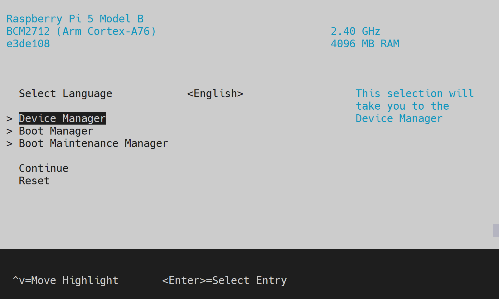

# Raspberry Pi 5 UEFI
This repository contains a TF-A + EDK2 UEFI firmware port for Raspberry Pi 5.



# Getting started
Check the [Supported OSes](#supported-oses) and [Supported peripherals in UEFI](#supported-peripherals-in-uefi) sections to see what's currently possible with this firmware.

## 1. Prerequisites
* #### SD card, USB or NVME drive to store the firmware and/or operating system on

  **Note:** For OS, it is highly suggested to use a quality drive with **good random I/O performance**. In SD terms this means an A1/A2-rated card.
  
* #### Quality power supply and cable that can provide at least 5V 3A (15 W)
  Depending on the peripherals you use, more power may be needed. The recommended official power supply provides 5.1V 5A (25 W).

  **Note:** Using an inadequate supply can cause all sorts of issues, from underclocking to random crashes.

* #### HDMI display

* #### Some form of cooling (fan, heatsink)
  The device may thermal throttle otherwise.

Optionally, if display is not available or for debugging purposes, an UART serial adapter compatible with the special connector. Configuration is `115200 8n1`.

## 2. Download the firmware image
The latest version can be obtained from [Releases](https://github.com/worproject/rpi5-uefi/releases).

## 3. Flash the firmware
Prepare an empty boot drive by formatting the first partition as FAT32, then extract the archive downloaded above to the root of this partition.

**Note:** do not rename or delete any of the boot files.

## 4. Connect peripherals and power on the device
You should first see a QR code screen, then shortly after, a centered Raspberry Pi logo with progress bar at the bottom. This indicates that the UEFI firmware has loaded.

At this stage, you can press <kbd>Esc</kbd> to enter the firmware setup, <kbd>F1</kbd> to launch the UEFI Shell, or, provided you also have an UEFI bootloader/app on a storage device, you can let the system automatically run that, which is the default behavior if no action is taken.

Check the configuration options described below, some of which may need to be changed depending on the OS used.

# Configuration settings
The UEFI provides options that can be viewed and changed using the UI configuration menu.

Configuration through the user interface is fairly straightforward and help/navigation information is provided around the menus.

## PCI Express
The PCIe connector is limited to Gen 2 speed by default. For other modes, go to `Device Manager`->`Raspberry Pi Configuration`->`PCI Express` and change `Link Speed`.

> [!NOTE]
> Raspberry Pi 5 is not officially rated for PCIe Gen 3. Some devices and adapters may run into reliability issues at this speed, either due to signal integrity or insufficient power.

## Linux
* If you're getting a Synchronous Exception when booting certain distros, go to `Device Manager`->`EFI Memory Attribute Protocol` and untick `Enable Protocol`.

* For maximum SD card performance, go to `Device Manager`->`Raspberry Pi Configuration`->`ACPI / Device Tree` and set `Compatibility Mode` to `Full Bay Trail`, then untick `Limit UHS-I Modes`.

  **Warning:** this may affect other OSes!

* To enable PCIe support, go to `Device Manager`->`Raspberry Pi Configuration`->`ACPI / Device Tree` and change `ECAM Compatibility Mode` to `AMAZON GRAVITON`.

* If you're running the RPi downstream kernel, enabling Device Tree instead of ACPI will provide better hardware support. To do so, go to `Device Manager`->`Raspberry Pi Configuration`->`ACPI / Device Tree` and change `System Table Mode`.

# Status

## Supported OSes
### In ACPI mode
ACPI support is currently under development and limited to a few devices that have existing driver bindings.

| OS | Version | Tested/supported hardware | Notes |
| --- | --- | --- | --- |
| Windows | 11 (including insider) | Display, USB, SD, SDIO, PCIe | * SD is limited to DDR50.<br> * PL011 UART driver fails to start, but debugging over it still works via DBG2.<br> * PCIe is limited to single-function devices. |
| Linux | tested Ubuntu 22.04, kernel 5.15.0-75-generic | Display, UART, USB, SD, SDIO (incl. Wi-Fi), PCIe | * SD is limited to HS by default.<br> * Wi-Fi may require manual firmware installation.<br> * PCIe is limited to single-function devices; needs to be enabled manually.<br> See [Configuration settings - Linux](#Linux). |
| FreeBSD | 13.2 | Display, UART, USB, SD, PCIe | * SD is limited to HS. |
| NetBSD | recent daily build | Display, UART, USB, PCIe | * SD fails to communicate with the card. |
| VMware ESXi Arm Fling | 1.15 | Display, UART, USB, PCIe | * Requires compatible USB network adapter. |

### In Device Tree mode
The included DTB is meant for the RPi downstream 6.1.y kernel.

## Supported peripherals in UEFI
> [!NOTE]
> Only devices relevant to the firmware itself (not OS) are listed below.

| Device | Status | Notes |
| --- | --- | --- |
| RP1 USB                            | 🟢 Working     | |
| RP1 Ethernet                       | 🔴 Not working | |
| RP1 GPIO                           | 🔴 Not working | |
| RP1 PWM                            | 🔴 Not working | Fan control |
| PCIe                               | 🟢 Working     | |
| SD                                 | 🟢 Working     | SD cards up to SDR104. eMMC support is unknown. |
| Display                            | 🟢 Working     | HDMI, driven by the VPU firmware. |
| UART                               | 🟢 Working     | PL011 available on the dedicated connector at 115200 8n1. |
| GPIO                               | 🟢 Working     | GIO/AON, pin function. |
| RTC                                | 🟢 Working     | Get/set time, wake up alarm. |
| RNG                                | 🟢 Working     | |
| EEPROM                             | 🔴 Not working | Needed for proper NVRAM. |

## Building
This process assumes a Linux machine. On Windows, use WSL.

1. Install required packages:

   For Ubuntu/Debian:
   ```bash
   sudo apt install git gcc g++ build-essential gcc-aarch64-linux-gnu iasl python3-pyelftools uuid-dev
   ```
   For Arch Linux:
   ```bash
   sudo pacman -Syu
   sudo pacman -S git base-devel gcc dtc aarch64-linux-gnu-binutils aarch64-linux-gnu-gcc aarch64-linux-gnu-glibc python python-pyelftools iasl --needed
   ```

2. Clone the repository:
   ```bash
   git clone --recurse-submodules https://github.com/worproject/rpi5-uefi.git
   cd rpi5-uefi
   ```

3. Build the image:
   ```bash
   ./build.sh
   ```
   Append `--help` for more details.

If you get build errors, it is very likely that you're still missing some dependencies. The list of packages above is not complete and depending on the distro you may need to install additional ones. In most cases, looking up the error messages on the internet will point you at the right packages.

## Licenses
Most files are licensed under the default EDK2 license, [BSD-2-Clause-Patent](https://github.com/tianocore/edk2/blob/master/License.txt).

For TF-A, see: <https://github.com/ARM-software/arm-trusted-firmware/blob/master/docs/license.rst>
